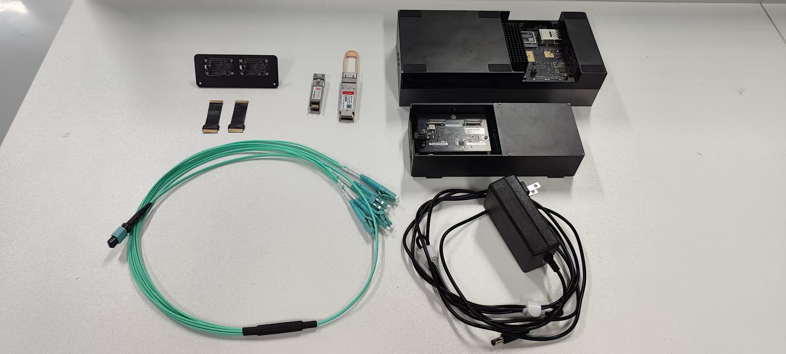
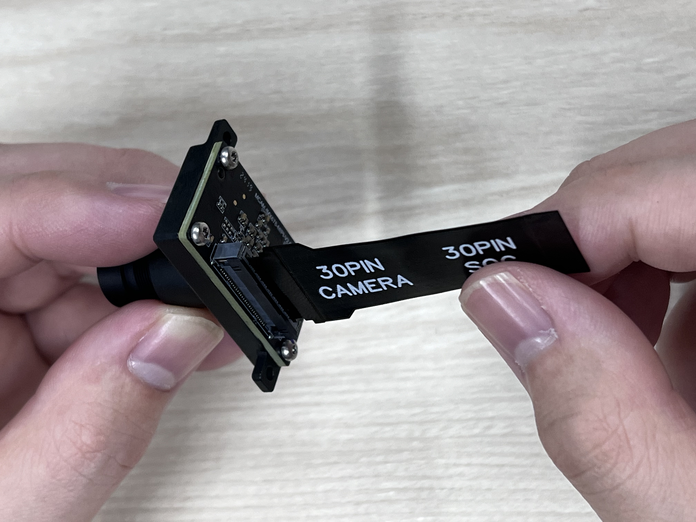
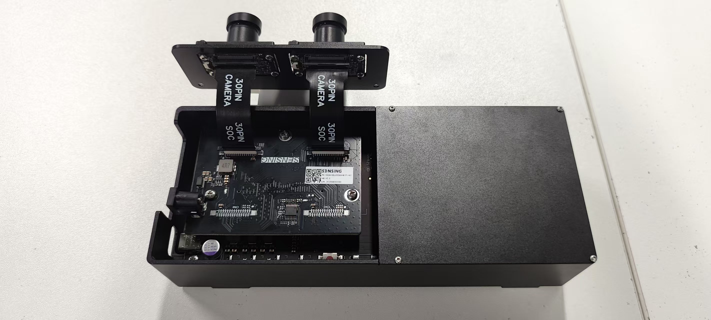
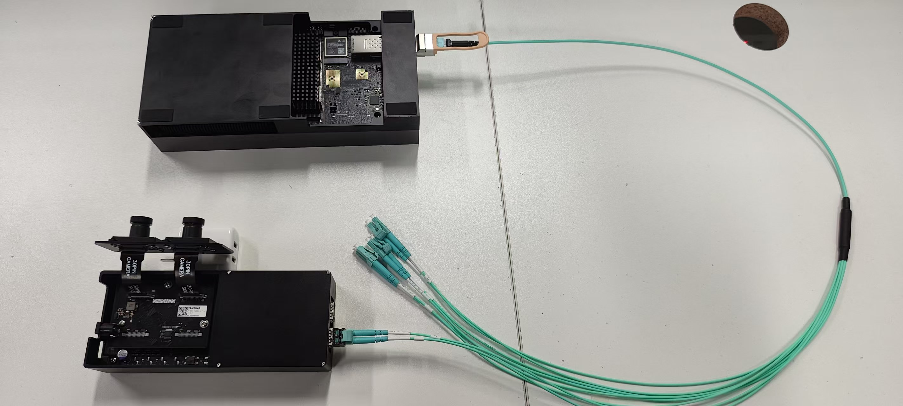

# Holoscan Sensor Bridge

## Introduction

Holoscan Sensor Bridge provides a FPGA based interface for low-latency sensor data
processing using GPUs. Peripheral device data is acquired by the FPGA and sent via UDP
to the host system where ConnectX devices can write that UDP data directly into GPU
memory. 
This software package based on nvidia official HSB v2.2.3 package and add supports for SENSING HSB cameras with 
[Lattice Holoscan Sensor Bridge device](https://www.latticesemi.com/products/developmentboardsandkits/certuspro-nx-sensor-to-ethernet-bridge-board)

## Setup

Holoscan sensor bridge software comes with an
[extensive user guide](https://docs.nvidia.com/holoscan/sensor-bridge/latest/),
including instructions for setup on
[NVIDIA IGX](https://www.nvidia.com/en-us/edge-computing/products/igx/) and
[NVIDIA AGX](https://developer.nvidia.com/embedded/learn/jetson-agx-Orin-devkit-user-guide/index.html)
configurations. Please see the user guide for host configuration and instructions on
running unit tests.

## Use With SENSING HSB MIPI Cameras

This software package add supports for following SENSING HSB cameras:

| Camera                          | Description               |
| :------------------------------ | ------------------------- |
| sg2_ar0234c_mipi                | 2MP RAW Camera            |
| sg3_isx031c_mipi                | 3MP YUV Camera            |
| sg8_imx678c_mipi                | 8MP RAW Camera            |

Currently supported for use on Jetson Agx Thor Devkit with Jetpack 6.0 or later

### Use with Jetson Agx Thor Devkit

1. **SENSING will provide the following accessorie**

    - Jetson Agx Thor Devkit (Provided By SENSING Or Use Your Own)
    - Holoscan Sensor Bridge Board with SENSING MIPI Camera Adapter
    - SENSING HSB MIPI Cameras
    - FPC Cable
    - 10 Gigabit Ethernet Fiber Optic Cable
    - 10 Gigabit Ethernet to SFP converter
    - Power adapter

    <p align="center">
        
    </p>

2. **Connect HSB MIPI Camera Onto Holoscan Sensor Bridge Board**

    - Connect FPC Cable With HSB MIPI Camera

    <p align="center">
        
    </p>

    - Fixed to the Holoscan Sensor Bridge Board

    <p align="center">
        
    </p>

3. **Connect all to Jetson Agx Thor Devkit**

    <p align="center">
        
    </p>

3. **Power Supply**

    - Provide 12v power supply to the Jetson AGX Thor DevKit
    - Provide 12v power supply to the Holoscan Sensor Bridge Board (A Type-C Power Supply)
    - Provide 12v power supply to the SENSING MIPI Camera Adapter On Holoscan Sensor Bridge Board

4. **Boot system and Bringup camera**

    - Please first complete the "Host Setup" described on [extensive user guide](https://docs.nvidia.com/holoscan/sensor-bridge/latest/)
    - Clone this software package onto device
    - Enter the software package path and execute the command "sh docker/build.sh -igpu" to build the Holoscan Sensor Bridge container
    - Execute the following command at the device terminal to getinto the demo container
        ```
        xhost +
        sh docker/demo.sh
        ```
    - Execute the following command to configure the camera startup environment
        ```
        echo "deb https://repo.download.nvidia.com/jetson/common r38.2 main" > /etc/apt/sources.list.d/nvidia-l4t-apt-source.list
        echo "deb https://repo.download.nvidia.com/jetson/som r38.2 main" >> /etc/apt/sources.list.d/nvidia-l4t-apt-source.list
        wget -O - https://repo.download.nvidia.com/jetson/jetson-ota-public.asc | apt-key add - 
        apt-get update
        apt-get install -y cuda-toolkit-13-0
        export PATH=/usr/local/cuda-13.0/bin:$PATH
        export LD_LIBRARY_PATH=/usr/local/cuda-13.0/lib64:$LD_LIBRARY_PATH
        pip3 uninstall -y cupy
        pip3 install cupy-cuda13x
        ```
    - Execute the following command to bringup SENSING MIPI Camera
        
        - For sg2_ar0234c_mipi
            ```
            python3 examples/linux_single_network_stereo_sg2_ar0234c_mipi_player.py
            ```
        - For sg3_isx031c_mipi
            
            *note* : only capturing image data and saving pictures are supported, and pictures will save to "captured_images_left" and "captured_images_right" folder
            ```
            python3 examples/linux_single_network_stereo_sg3_isx031c_mipi_player.py
            ```
        - For sg8_imx678c_mipi
            ```
            python3 examples/linux_single_network_stereo_sg8_imx678c_mipi_player.py
            ```