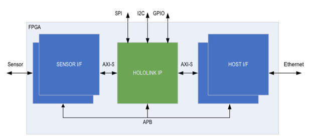
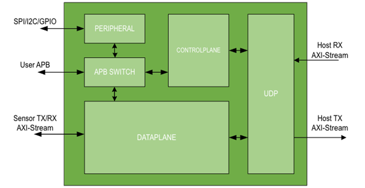

# Overview

The Nvidia Holoscan Sensor Bridge FPGA IP pairs with the Holoscan software and delivers
to the end user a sensor-agnostic data-to-ethernet host platform. This IP simplifies and
accelerates the FPGA design and can be scaled and configured to adapt to various
sensor-to-host applications.

Major functions of the Holoscan Sensor Bridge IP include:

1. Encapsulate sensor AXI-Stream data into ethernet UDP AXI-Stream data for host
   processing.
1. Perform BOOTP, ICMP, and Nvidia defined Ethernet Control Bus (ECB) Networking
   Protocols.
1. Transmit enumeration packets and control event packets for pre-defined conditions.
1. Control peripheral interfaces, such as SPI/I2C/GPIO, to configure sensors and other
   on-board components.

The block diagram of the Holoscan Sensor Bridge IP in the FPGA is depicted below. The
Sensor Interface and Host (Ethernet) Interface blocks are FPGA vendor specific logic.

 Figure 1. Holoscan
Sensor Bridge IP in FPGA

## Holoscan Sensor Bridge IP Architecture

The architecture of the Holoscan Sensor Bridge IP is depicted below.

 Figure 2. Holoscan
Sensor Bridge IP Architecture

There are 2 main planes of data bridging in the Holoscan Sensor Bridge IP, the Dataplane
and the Controlplane. The Dataplane is data transfer relevant to sensor data as it gets
packetized to UDP packets. The Controlplane is data transfer relevant to host control.
The Controlplane could be receiving and decoding UDP packets from the host to access a
register or transmitting specific network protocols the Holoscan Sensor Bridge IP
supports.

## Resource Utilization

Resource utilization of the Holoscan Sensor Bridge IP can be provided upon request.
